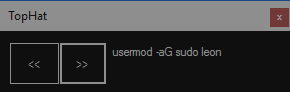

# TopHat

Snippet assistant for presentations on Windows.

Use next and previous to move through a set of snippets that are loaded from a file. When you press next or previous, the relevant snippet is shown onscreen *and copied to your clipboard*. (Snippets are assumed to be separated by '#' comments)

The snippet file can be set by passing a commandline parameter. (If not set there, you are asked to select a file)

You can also specify a set of "ReplaceThis`WithThis" token pairs. What does that mean? Well it's a handy little feature though it does take a bit of explaining. Let me furnish you with an example...

Your script file might mention a particular IP Address over and over. But that IP Address is really
just a *placeholder* for the *actual* IP Address you will use on the day. If so specify a "ReplaceThis`WithThis" token pair, that will be used to replace the place holder IP Address (before the backtick) with the actual IP Address (after the backtick). 

There are two ways to specify "ReplaceThis`WithThis" token pairs. You can specify them at the command line (details below) or by right clicking on the user interface, where there is a menu button entitled 'Add {ReplaceThis}`{WithThis} token...'. That context menu also shows any token pairs that are already defined, and allows you to edit them, by clicking on them. 

## Commandline help:

    Top Hat
    Snippet assistant for presentations on Windows.

    Usage: TopHat.exe [options]

    Options:
      -s, --snippets=VALUE       snippet file (separated by '#' comments)
      -r, --replacements=ReplaceThis
                                  comma separated set of {ReplaceThis}`{WithThis}
                                   token pairs
      -?, -h, --help             show this message and exit
